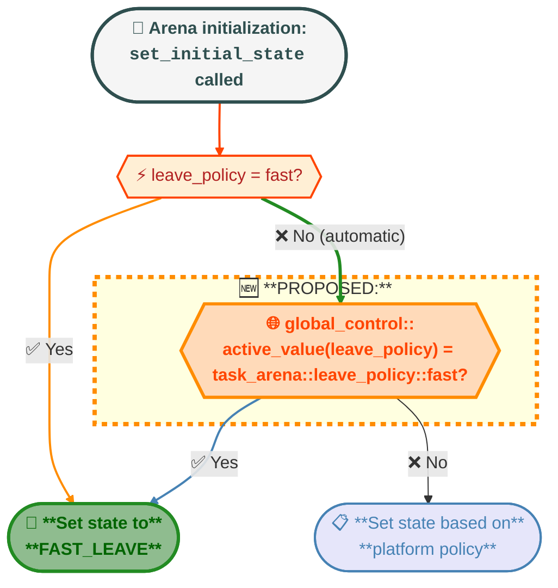

# Global Control Parameter for Worker Fast Leave Behavior

## Introduction

In oneTBB 2021.13.0, PR https://github.com/uxlfoundation/oneTBB/pull/1352 introduced a change to
worker thread behavior that causes them to spin after completing work before leaving an arena
(delayed leave). While this optimization improves performance for workloads with frequent parallel
phases by keeping workers readily available, it can cause performance regressions for workloads
that interleave short parallel phases with single-threaded work.

The root cause is that spinning worker threads increase CPU load even when yielding, which can
reduce clock speeds due to thermal and power management. This is particularly problematic in
scenarios where single-threaded code constitutes a significant portion of the workload.

Issue https://github.com/uxlfoundation/oneTBB/issues/1876 reports this regression with a
reproducible example demonstrating ~8% slowdown in wall-clock time. The reporter notes that while
the `parallel_phase` API provides per-arena control over this behavior, a simpler global mechanism
would be preferable for many use cases.

### Motivation

- **Performance restoration**: Applications experiencing performance regressions from the delayed
  leave behavior need a simple way to restore previous behavior without modifying code throughout
  the application.
- **Simplified control**: While the `parallel_phase` API provides fine-grained per-arena control,
  many applications would benefit from a single global switch that affects all arenas.
- **Backward compatibility**: The solution should allow applications to opt into fast leave
  behavior without requiring changes to existing `task_arena` construction or parallel algorithm
  calls.

### Related Work

The `parallel_phase` API (RFC:
[parallel_phase_for_task_arena](https://github.com/uxlfoundation/oneTBB/tree/master/rfcs/experimental/parallel_phase_for_task_arena))
provides per-arena control over worker retention through `task_arena::leave_policy` and
`start_parallel_phase`/`end_parallel_phase` functions. This proposal complements that feature by
providing a global override mechanism.

## Proposal

This proposal introduces a new `global_control` parameter called `leave_policy` that, when set to "fast",
would override the default behavior for arenas that are initialized with `leave_policy::automatic`.
Setting the parameter would not affect arenas that are already initialized or initialized with an
explicit `leave_policy`. After initialization, the parallel phase API can independently modify the
arena's leave behavior at runtime, allowing workers to be retained during active parallel phases
regardless of the initial state set by the global control.

### New Public API

The proposal adds a new enumeration value to the existing `global_control::parameter` enum:

#### Header

```cpp
#define TBB_PREVIEW_PARALLEL_PHASE 1
#include <oneapi/tbb/global_control.h>
```

#### Syntax

```cpp
#define TBB_HAS_PARALLEL_PHASE 202xxx

namespace oneapi {
namespace tbb {

class global_control {
public:
    enum parameter {
        max_allowed_parallelism,
        thread_stack_size,
        terminate_on_exception,
        scheduler_handle,  // not a public parameter
#if TBB_PREVIEW_PARALLEL_PHASE
        leave_policy,      // NEW: Controls worker fast leave behavior
#endif
        parameter_max
    };

    global_control(parameter p, size_t value);
    ~global_control();

    static size_t active_value(parameter p);
};

}}
```

#### Semantics

The `leave_policy` parameter would control whether arenas are initialized with automatic or fast leave policy by default:

| Value | Behavior |
|-------|----------|
| `task_arena::leave_policy::automatic` (default) | Workers follow the default system-specific policy (may spin before leaving) |
| `task_arena::leave_policy::fast` | Workers leave immediately (fast leave enabled) |

When multiple `global_control` objects exist for `leave_policy`, their logical disjunction would be
used (consistent with the `terminate_on_exception` parameter). This means if any
`global_control(leave_policy, task_arena::leave_policy::fast)` is active, fast leave would be enabled globally.

### Proposed Implementation Strategy

The proposed implementation would modify the `thread_leave_manager::set_initial_state` to include an additional check
for the global `leave_policy` parameter when determining the initial state for worker retention. When the former is set
to `fast`, the method would treat the arena as if it were initialized with `leave_policy::fast`.



### Interaction with Parallel Phase API

The `global_control::leave_policy` parameter affects the initial state set by `thread_leave_manager`. Once
the initial state is determined, the parallel phase API independently modifies the state machine at runtime.
The global control is not consulted again after initialization.

| Arena `leave_policy` | Global `leave_policy` | Initial State |
|----------------------|-----------------------|---------------|
| `fast` | any | `FAST_LEAVE` |
| `automatic` | `fast` | `FAST_LEAVE` |
| `automatic` | `automatic` (default) | Platform policy |

This design ensures that:
1. Explicit per-arena `leave_policy::fast` always results in fast leave
2. Active parallel phases always retain workers, as `start_parallel_phase()` independently
   transitions the state machine to `PARALLEL_PHASE`
3. The global `leave_policy` parameter only affects the initial state of arenas initialized with
   `leave_policy::automatic`

### Specification Extension

This API would be introduced under the `TBB_PREVIEW_PARALLEL_PHASE` macro, consistent with the
related parallel phase feature.

#### oneTBB Documentation Update (Preview State)

While the feature is in preview state, the
[parallel phase API reference](https://github.com/uxlfoundation/oneTBB/blob/master/doc/main/reference/parallel_phase_for_task_arena.rst)
would need to be extended with documentation for the `global_control::leave_policy` parameter:
- Add a new section "Global Control Integration" describing the `leave_policy` parameter
- Update the Synopsis to include the `global_control` header and `leave_policy` parameter
- Add a description of the parameter semantics and selection rule (logical disjunction)
- Document the interaction between `global_control::leave_policy` and per-arena `leave_policy`
- Add usage examples showing how to combine global fast leave with parallel phases
- Include a note explaining that `global_control::leave_policy` provides application-wide control
  while `task_arena::leave_policy` and `parallel_phase` provide per-arena control

#### oneAPI Specification Update

Once this feature is stabilized and moved from preview to supported status, the oneAPI
specification would need to be updated. Specifically, the
[global_control class documentation](https://github.com/uxlfoundation/oneAPI-spec/blob/main/source/elements/oneTBB/source/task_scheduler/scheduling_controls/global_control_cls.rst)
would need to be extended with
- a new entry in the `parameter` enumeration
- documentation of the interaction with `task_arena::leave_policy` and the `parallel_phase` API
- usage guidance for when this parameter is appropriate versus per-arena control mechanisms

### Thread Safety

The implementation would use the existing thread-safe `control_storage` infrastructure:
- `global_control` construction/destruction would be thread-safe
- `active_value()` queries would be thread-safe

### Performance Impact

The proposed implementation would have minimal performance impact:

| Scenario | Impact |
|----------|--------|
| Arena initialization | One additional branch in `thread_leave_manager::set_initial_state` |
| Memory overhead | One additional `control_storage` object per process |

The additional branch is only evaluated once per arena initialization (not on the worker leave hot path).

### Backward Compatibility

- **API Compatibility**: No existing APIs would be modified; a new enum value would be added
- **ABI Compatibility**: The internal `control_storage` object array size would change, requiring
  library rebuild but no changes to existing binaries
- **Behavioral Compatibility**: Default behavior (leave_policy=automatic) would match current behavior

### Usage Examples

#### Basic Usage

```cpp
#define TBB_PREVIEW_PARALLEL_PHASE 1
#include <oneapi/tbb/global_control.h>
#include <oneapi/tbb/parallel_for.h>

int main() {
    // Enable fast leave globally for the duration of this scope
    tbb::global_control gc(tbb::global_control::leave_policy, tbb::task_arena::leave_policy::fast);

    for (int i = 0; i < 1000; ++i) {
        // Single-threaded work benefits from reduced CPU load
        do_serial_work();

        // Parallel work - workers leave immediately after completion
        tbb::parallel_for(0, 1000000, [](int j) {
            do_parallel_work(j);
        });
    }
}
```

#### Global Control Scope, Initialization Order, and Disjunction

```cpp
// No global_control is active yet; this call lazily initializes the implicit arena with automatic (the default).
// Once initialized, the implicit arena's leave policy is fixed and not affected by later global_control changes.
tbb::parallel_for(0, 1000000, [](int i) { do_parallel_work(i); });

{
    tbb::global_control gc1(tbb::global_control::leave_policy, tbb::task_arena::leave_policy::fast);
    tbb::task_arena arena1;
    // arena1 is lazily initialized on first use; since gc1 is active, it is initialized with fast leave.
    arena1.execute([&] { /* ... */ });

    // The implicit arena was already initialized with automatic above; gc1 does not affect it retroactively.
    tbb::parallel_for(0, 1000000, [](int i) { do_parallel_work(i); });

    {
        tbb::global_control gc2(tbb::global_control::leave_policy, tbb::task_arena::leave_policy::automatic);
        tbb::task_arena arena2;
        // Both gc1 (fast) and gc2 (automatic) are active. Disjunction rule: any fast value present => fast wins.
        arena2.execute([&] { /* ... */ });
    }
}

tbb::task_arena arena3;
// Both gc1 and gc2 are now destroyed, so arena3 is initialized with automatic (the default).
arena3.execute([&] { /* ... */ });
```

#### Combining with Parallel Phase API

```cpp
tbb::task_arena arena;
tbb::global_control gc(tbb::global_control::leave_policy, tbb::task_arena::leave_policy::fast);

// Before entering the parallel phase, the arena is initialized with FAST_LEAVE due to the active global control.
// Global leave_policy is active, but parallel_phase overrides it
arena.start_parallel_phase();

arena.execute([&] {
    tbb::parallel_for(/* ...  */);
});

// Some serial computation

// More parallel work without worker re-acquisition overhead
arena.execute([&] {
    tbb::parallel_sort(/* ...  */);
});

arena.end_parallel_phase();
// After parallel_phase ends, workers leave immediately due to arena's initial FAST_LEAVE state
```

### Testing Strategy

The following test scenarios would be required:

1. **Functional tests**:
   - Verify `active_value(leave_policy)` returns correct values
   - Verify arenas initialized when leave_policy=fast have workers leave immediately
   - Verify default behavior preserved when leave_policy=automatic

2. **Interaction tests**:
   - Test interaction with `leave_policy::fast` arenas
   - Test interaction with `leave_policy::automatic` arenas
   - Test interaction with parallel phase API
   - Test with multiple concurrent arenas

3. **Performance tests**:
   - Benchmark workloads similar to the one in issue https://github.com/uxlfoundation/oneTBB/issues/1876
   - Verify no regression with leave_policy=automatic

## Alternatives Considered

### Alternative 1: Environment Variable

An environment variable (e.g., `TBB_LEAVE_POLICY=FAST`) could control the behavior at startup.

**Pros:**
- No code changes required
- Can be set externally

**Cons:**
- Cannot be changed at runtime
- Less discoverable than API
- Inconsistent with other oneTBB configuration mechanisms

### Alternative 2: Default to Fast Leave

The default behavior could be changed to fast leave, making delayed leave opt-in.

**Pros:**
- Addresses the regression for all affected users automatically
- Simpler mental model

**Cons:**
- Fixes performance regression for some customers while causing it for others

## Open Questions

1. **Naming**: Should it convey "default override" semantics?
   - Current proposal: parameter name matches `task_arena::leave_policy` for consistency
   - Alternative: e.g., `override_default_leave_policy` to clarify no effect on already initialized arenas

2. **Scope and Granularity**
   - Current proposal: only affect arenas initialized after the `global_control` is set
   - Alternative: allow retroactive effect on existing arenas
   - Alternative: allow per worker control (e.g., via observers) to enable/disable fast leave on a per-thread basis

3. **Composition**: Should the global control be a logical disjunction, first-registered wins, last-set wins, etc.?
   - Current proposal: disjunction

## Exit Criteria

The following conditions need to be met to move the feature from experimental to fully supported:
- Open questions regarding the API should be resolved.
- User feedback should confirm usability and performance improvements in mentioned scenarios and that no unforeseen
  issues arise.
- The feature must be added to the oneTBB specification and accepted.
