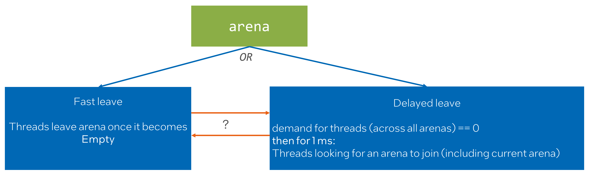
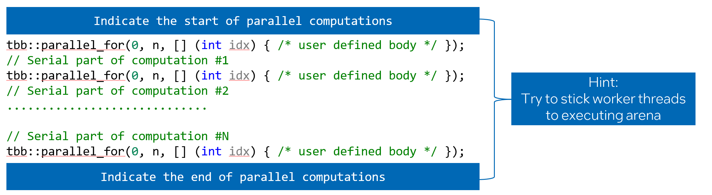
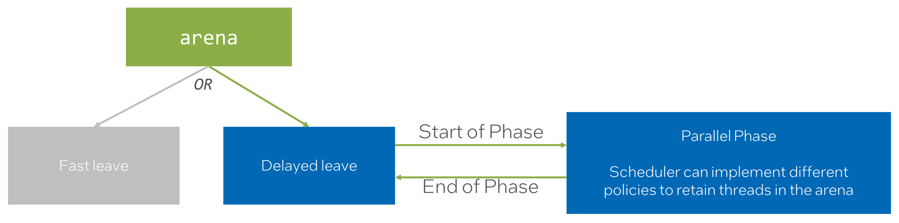
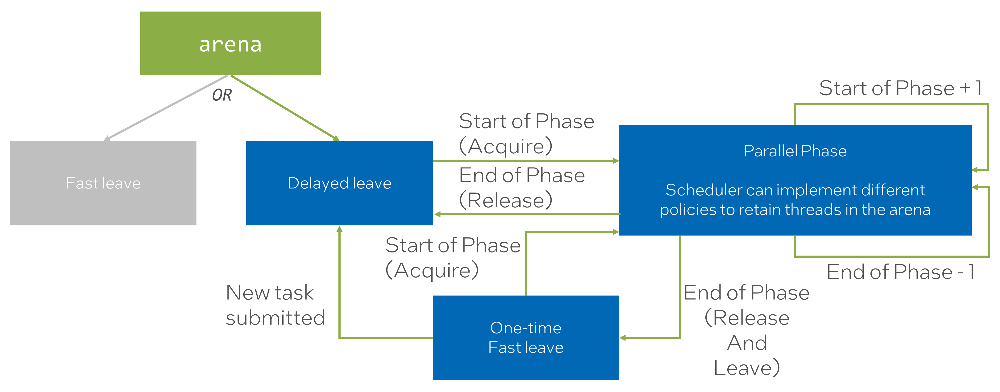
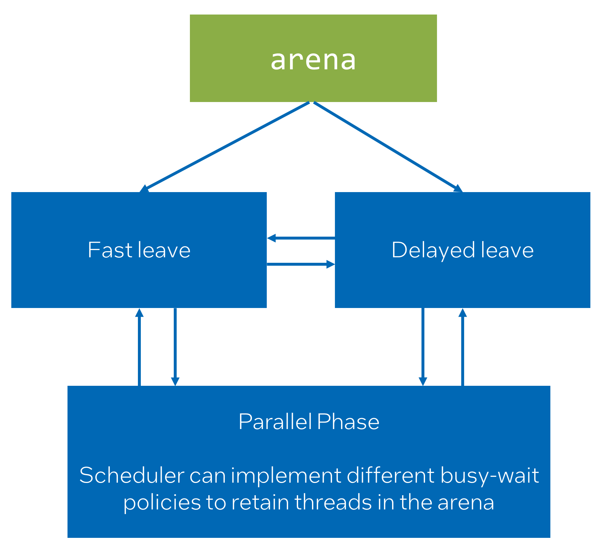
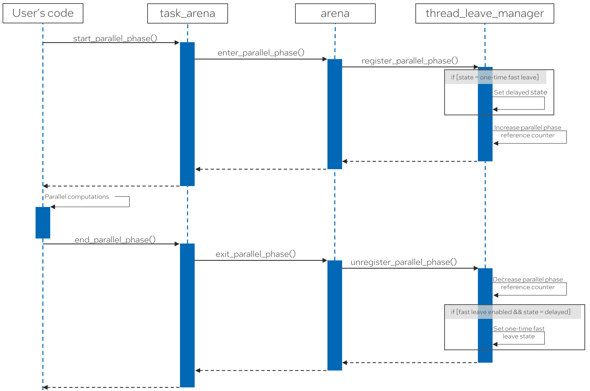

# Adding API for parallel phase to task_arena to warm-up/retain/release worker threads

## Introduction

In oneTBB, there has never been an API that allows users to block worker threads within the arena.
This design choice was made to preserve the composability of the application.
Before PR#1352, workers moved to the thread pool to sleep once there were no arenas with active
demand. However, PR#1352 introduced a delayed leave behavior to the library that
results in blocking threads for an _implementation-specific_ duration inside an arena
if there is no active demand arcoss all arenas. This change significantly
improved performance for various applications on high thread count systems.
The main idea is that usually, after one parallel computation ends,
another will start after some time. The delayed leave behavior is a heuristic to utilize this,
covering most cases within _implementation-specific_ duration.

However, the new behavior is not the perfect match for all the scenarios:
* The heuristic of delayed leave is unsuitable for the tasks that are submitted
  in an unpredictable pattern and/or durations.
* If oneTBB is used in composable scenarios it is not behaving as
  a good citizen consuming CPU resources.
  * For example, if an application runs a series of stages where oneTBB is used for one stage
    and OpenMP is used for a subsequent stage, there is a chance that oneTBB workers will
    interfere with OpenMP threads. This interference might result in slight oversubscription,
    which in turn might lead to underperformance.

So there are two related problems but with different resolutions:
* Completely disable new behavior for scenarios where the heuristic of delayed leave is unsuitable.
* Optimize library behavior so customers can benefit from the heuristic of delayed leave but
  make it possible to indicate that "it is the time for the TBB arena to release threads".

## Proposal

Let's tackle these problems one by one.

### Completely disable new behavior

Let’s consider both “Delayed leave” and “Fast leave” as 2 different states in state machine.<br>
* The "Delayed leave" heuristic benefits most of the workloads. Therefore, this is the 
  default behavior for arena. 
* Workloads that has rather negative performance impact from the heuristic of delayed leave
  can create an arena in “Fast leave” state.



One question was whether we should allow the arena to dynamically transition from one state to
another. Due to the lack of use cases that would justify this, the decision is to keep the state
static for the lifetime of the arena. The underlying implementation is already flexible enough
that dynamic state transitions could be added later without a redesign (see [technical details](#technical-details)).

### When threads should leave?

oneTBB itself can only guess when the ideal time to release threads from the arena is.
Therefore, it does its best effort to preserve and enhance performance without completely
messing up composability guarantees (that is how delayed leave is implemented).

As we already discussed, there are cases where it does not work perfectly,
therefore customers that want to further optimize this
aspect of oneTBB behavior should be able to do it.

This problem can be considered from another angle. Essentially, if the user can indicate
where parallel computation ends, they can also indicate where it starts.



With this approach, the user not only releases threads when necessary but also specifies a
programmable block where worker threads should expect new work coming regularly
to the executing arena.

Let’s add a new state to the existing state machine. To represent "Parallel Phase" state.

> **_NOTE:_** The "Fast leave" state is colored Grey just for simplicity of the chart.
              Let's assume that arena was created with the "Delayed leave". 
              The logic demonstrated below is applicable to the "Fast leave" as well.



This state diagram leads to several questions:
* What if there are multiple Parallel Phases?
* If “End of Parallel Phase” leads back to “Delayed leave” how soon will threads
  be released from arena?
  * What if we indicated that threads should leave arena after the "Parallel Phase"?
  * What if we just indicated the end of the "Parallel Phase"?

The extended state machine aims to answer these questions.
* The first call to the “Start of Phase” will transition into the “Parallel Phase” state.
* The last call to the “End of Phase” will transition back to the “Delayed leave” state
  or into the "One-time Fast leave" if it is indicated that threads should leave sooner.
* Concurrent or nested calls to the “Start of Phase” or the “End of Phase”
  increment/decrement a reference counter.



Let's consider the semantics that an API for explicit parallel phases can provide:
* Start of a parallel phase:
  * Indicates the point from which the scheduler can use a hint and keep threads in the arena
    for longer.
  * Serves as a warm-up hint to the scheduler:
    * Allows reducing delays of computation start by initiating the wake-up of worker threads
      in advance.
* "Parallel phase" itself:
  * Scheduler can implement different policies to retain threads in the arena.
    * For instance, more aggressive policy might be implemented for _parallel phase_.
      It can be beneficial in cases when the default arena leave policy is not sufficient enough.
  * The semantics for retaining threads is a hint to the scheduler;
    thus, no real guarantee is provided. The scheduler can ignore the hint and
    move threads to another arena or to sleep if conditions are met.
* End of a parallel phase:
  * Indicates the point from which the scheduler may drop the hint and
    no longer retain threads in the arena.
  * Indicates that worker threads should avoid busy-waiting once there is no more work in the arena.
    * Temporarily overrides the default arena leave policy, which will be restored when
      new work is submitted.


### Proposed API

Summary of API changes:

* Add enumeration class for the arena leave policy.
* Add the policy as the last parameter to the arena constructor and initializer
defaulted to "automatic".
* Add functions to start and end the parallel phase to the `task_arena` class
and the `this_task_arena` namespace.
* Add a `task_arena::parallel_phase` RAII class to map a parallel phase to a code scope.

```cpp
class task_arena {
    enum class leave_policy : /* unspecified type */ {
        automatic = /* unspecified */,
        fast = /* unspecified */,
    };

    task_arena(int max_concurrency = automatic, unsigned reserved_for_masters = 1,
               priority a_priority = priority::normal,
               leave_policy a_leave_policy = leave_policy::automatic);

    task_arena(const constraints& constraints_, unsigned reserved_for_masters = 1,
               priority a_priority = priority::normal,
               leave_policy a_leave_policy = leave_policy::automatic);

    void initialize(int max_concurrency, unsigned reserved_for_masters = 1,
                    priority a_priority = priority::normal,
                    leave_policy a_leave_policy = leave_policy::automatic);

    void initialize(constraints a_constraints, unsigned reserved_for_masters = 1,
                    priority a_priority = priority::normal,
                    leave_policy a_leave_policy = leave_policy::automatic);

    class parallel_phase {
        class flags {
            // Available only when each type in Flags is a parallel phase flag
            template <typename... Flags>
            flags(Flags... f);
        };
        class end_with_fast_leave;
        parallel_phase(attach, flags f = {});
        parallel_phase(task_arena& ta, flags f = {});
        parallel_phase(parallel_phase&& other);
        parallel_phase& operator=(parallel_phase&& other);
        void end();
    };
    
    void start_parallel_phase(parallel_phase::flags f = {});
    void end_parallel_phase(parallel_phase::flags f = {});
};

namespace this_task_arena {
    void start_parallel_phase(task_arena::parallel_phase::flags f = {});
    void end_parallel_phase(task_arena::parallel_phase::flags f = {});
}
```
The _parallel phase_ continues until each previous `start_parallel_phase` call
to the same arena has a matching `end_parallel_phase` call.

#### Using RAII to manage parallel phase

Let's also introduce an RAII object `parallel_phase` that will help to manage the contract.
Rather than introducing a separate RAII type in the `this_task_arena` namespace,
`task_arena::parallel_phase` can be constructed with the `tbb::attach` tag to map the phase to
the implicit arena associated with the calling thread. The alternative would be, instead of
passing `tbb::attach`, to have a factory function that returns a `pararlel_phase` object:
```cpp
class task_arena {
    parallel_phase create_parallel_phase(parallel_phase::flags f = {});
};

namespace this_task_arena {
    task_arena::parallel_phase create_parallel_phase(task_arena::parallel_phase::flags f = {});
}
```
The factory function approach might seem more consistent with the rest of task arena API.
As there are no clear advantages of factory function, the proposal is to stick to the constructor approach
since it is an already established pattern of the feature during experimental stage.

The RAII object is move-constructible and move-assignable, but not copyable. For a `parallel_phase`
bound to an explicit arena, the requirement is that the arena itself must not be destroyed
while the phase is still active. A `parallel_phase` created with `tbb::attach` is bound to the
implicit arena of the creating thread, so it must not end outside of that same implicit arena.

#### Flags

Note that all the entry points accept a single `parallel_phase::flags` argument rather than a
boolean flag, even though only one flag is defined for now. Since _parallel phase_ is a high-level
hint to the scheduler, it makes sense that other scheduling hints could be tied to it as well, so
the API is designed to be configurable. Each flag is a distinct tag type, and several of them can
be combined into a single `flags` object.

Some flags are only applicable to the start of a parallel phase, and others only to its end, which
can be reflected in their names (e.g. `end_with_fast_leave`). The `parallel_phase` object accepts flags
for both boundaries at once and applies each of them at the corresponding point, while the explicit
functions only take into account the flags applicable to them. A flag passed to an operation it
does not apply to is ignored. 

#### Starting and ending a parallel phase

The start of _parallel phase_ can also be used as a warm-up hint for the workers to enter
the arena in advance, therefore the arena (including the implicit arena bound to the external thread)
must be initialized during the first call to `start_parallel_phase`. It means that if a calling thread has
no associated arena yet, the invocation of `this_task_arena::start_parallel_phase` will initialize
an arena and bind it to the calling thread.

As mentioned above, the arena lifetime must not end while a parallel phase is still active.
It is the user's responsibility to call `end_parallel_phase` for every outstanding `start_parallel_phase`
(or destroy the corresponding `parallel_phase` object) before the arena is destroyed (or, for an implicitly
created arena, before the owning thread completes). Otherwise, the behavior is undefined.

#### RAII vs explicit calls

Introduction of the explicit functions `start_parallel_phase` and `end_parallel_phase` opens
a possibility of misuse: either forgetting to pair phase starts with ends, which results in
undefined behavior as described above, or doing more phase ends than starts
(e.g. by using RAII class interchangeably with explicit calls).
That raises a question of whether the parallel phase API should be limited only to the RAII style.
To answer this question, we considered the use cases where explicit calls are more preferable.

One such use case is asynchronous handoff, where the start and the end of a parallel phase happen
in different scopes, potentially executed on different threads, so there is no single scope
to attach an RAII guard to:
```cpp
void handle_request(Request req) {
    tbb::this_task_arena::start_parallel_phase();
    //
    // Some composition of parallel and serial computations
    //
    tbb::this_task_arena::enqueue([req]() {
        process(req);
        tbb::this_task_arena::end_parallel_phase(
            tbb::task_arena::parallel_phase::end_with_fast_leave{});
    });
}
```

The same use case can be expressed using the `parallel_phase` object:

```cpp
void handle_request(Request req) {
    tbb::task_arena::parallel_phase phase{tbb::attach{},
                                          tbb::task_arena::parallel_phase::end_with_fast_leave{}};
    // Some composition of parallel and serial computations
    //
    tbb::this_task_arena::enqueue([req, phs = std::move(phase)]() {
        process(req);
        // phs destructor will indicate the end of the parallel phase
    });
}
```
Another use case is a long-lived service where the parallel phase is meant to span multiple,
unrelated requests and should only end after a period of inactivity, e.g. driven by an idle timer
rather than the destruction of a scope:
```cpp
class Service {
    tbb::task_arena ta;
    bool phase_started = false;

    void on_request() {
        if (!phase_started) {
            ta.start_parallel_phase();
            phase_started = true;
        }
        ta.execute([]() { /* work */ });
        reset_idle_timer();
    }

    void on_idle_timeout() {
        ta.end_parallel_phase();
        phase_started = false;
    }
};
```
This use case can also be expressed using the `parallel_phase` object:
```cpp
class Service {
    tbb::task_arena ta;
    std::unique_ptr<tbb::task_arena::parallel_phase> phase;

    void on_request() {
        if (!phase) {
            phase = std::make_unique<tbb::task_arena::parallel_phase>(ta);
        }
        ta.execute([]() { /* work */ });
        reset_idle_timer();
    }

    void on_idle_timeout() {
        phase.reset();
    }
};
```
The friction of dealing with the RAII object in these cases can be considered too high, so the decision
is to provide the explicit `start_parallel_phase`/`end_parallel_phase` functions in addition to the
RAII `parallel_phase` class.

### Examples

Following code snippets show how the new API can be used.

```cpp
void task_arena_leave_policy_example() {
    tbb::task_arena ta{tbb::task_arena::automatic, 1, priority::normal, leave_policy::fast};
    ta.execute([]() {
        // Parallel computation
    });
    // Different parallel runtime is used
    // so it is preferred that worker threads won't be retained
    // in the arena at this point.
    #pragma omp parallel for
    for (int i = 0; i < work_size; ++i) {
        // Computation
    }
}

void parallel_phase_example() {
    tbb::this_task_arena::start_parallel_phase();
    tbb::parallel_for(0, work_size, [] (int idx) {
        // User defined body
    });

    // Some serial computation

    tbb::parallel_for(0, work_size, [] (int idx) {
        // User defined body
    });
    tbb::this_task_arena::end_parallel_phase(
        tbb::task_arena::parallel_phase::end_with_fast_leave{});

    // Different parallel runtime (for example, OpenMP) is used
    // so it is preferred that worker threads won't be retained
    // in the arena at this point.
    #pragma omp parallel for
    for (int i = 0; i < work_size; ++i) {
        // Computation
    }
}

void parallel_phase_raii_example() {
    tbb::task_arena ta{/*arena constraints*/};
    {
        // Start of the parallel phase
        tbb::task_arena::parallel_phase phase{ta,
            tbb::task_arena::parallel_phase::end_with_fast_leave{}};
        ta.execute([]() {
            // Parallel computation
        });

        // Serial computation

        ta.execute([]() {
            // Parallel computation
        });
    } // End of the parallel phase

    // Different parallel runtime (for example, OpenMP) is used
    // so it is preferred that worker threads won't be retained
    // in the arena at this point.
    #pragma omp parallel for
    for (int i = 0; i < work_size; ++i) {
        // Computation
    }
}
```

## Considerations

The alternative approaches were also considered.<br>
We can express this state machine as complete graph and provide low-level interface that
will give control over state transition.



We considered this approach too low-level. Plus, it leaves a question: "How to manage concurrent changes of the state?".

The retaining of worker threads should be implemented with care because
it might introduce performance problems if:
* Threads cannot migrate to another arena because they are
  retained in the current arena.
* Compute resources are not homogeneous, e.g., the CPU is hybrid.
  Heavier involvement of less performant core types might result in artificial work
  imbalance in the arena.

## Technical Details

To implement the proposed feature, the following changes were made:
* Added a new entity `thread_leave_manager` to the `r1::arena` which is responsible for
  for managing the state of workers' arena leaving behaviour.
* Introduced two new entry points to the library.
  * `r1::enter_parallel_phase(d1::task_arena_base*, std::uintptr_t)` - used to communicate
    the start of parallel phase with the library.
  * `r1::exit_parallel_phase(d1::task_arena_base*, std::uintptr_t)` - used to communicate
    the end of parallel phase with the library.

### Thread Leave Manager

`thread_leave_manager` class implements the state machine described in proposal.
Specifically, it controls when worker threads are allowed to be retained in the arena.
`thread_leave_manager` is initialized with a state that determines the default
behavior for workers leaving the arena.
If the dynamic leave policy change is required, new entry points can be added to control the state of
`thread_leave_manager` at runtime.

To support `start/end_parallel_phase` API, it provides functionality to override the default
state with a "Parallel Phase" state. It also keeps track of the number of active parallel phases.

The following sequence diagram illustrates the interaction between the user and
the `thread_leave_manager` during the execution of parallel phases. It shows how the
`thread_leave_manager` manages the state transitions when using `start/end_parallel_phase`.



## Performance testing

The [seismic example](../../../examples/parallel_for/seismic) can be a good candidate for measuring
the impact of _parallel phase_, since each frame invokes two `parallel_for` loops in sequence
(stress update, then velocity update), so worker threads may leave the arena prematurely
between updates or between frames instead of staying resident for the whole simulation.
Wrapping the per-frame loops with `start/end_parallel_phase` should retain workers across frames
and thus reduce the arena join/leave overhead.

The example can also showcase the `end_with_fast_leave` flag: if one of the two per-frame loops
were rewritten with a different runtime (e.g. OpenMP), calling `end_parallel_phase` with
`end_with_fast_leave` before that loop would release oneTBB workers promptly, avoiding
oversubscription/interference with the OpenMP threads.

## Conditions to become fully supported

Following conditions need to be met for the feature to move from experimental to fully supported:
* Open questions regarding API should be resolved.
* oneTBB specification needs to be updated to reflect the new feature.
