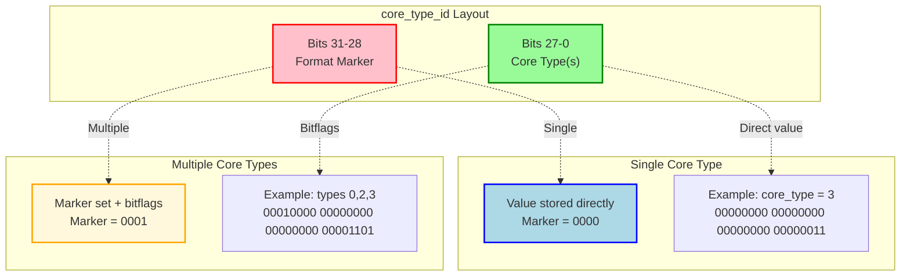

# Advanced Core Type Selection

## Introduction

### Motivation

By default, oneTBB includes all available core types in a task arena unless explicitly constrained.
The current oneTBB API allows users to constrain task execution to a single core type using
`task_arena::constraints::set_core_type(core_type_id)`. While this provides control, it creates limitations for
real-world applications running on processors with more than two core types (e.g., on a system with performance (P),
efficient (E), and low power efficient (LP E) cores):

#### 1. **Flexibility and Resource Utilization**

While it is often best to allow the OS to use all core types and flexibly schedule threads, some advanced users may find it necessary to constrain scheduling.
When there are more than two core types, it may be desired to constrain execution to not just a single core type.
Many parallel workloads can execute efficiently on multiple core types that make up a subset of the available core types. For example:
- A parallel algorithm with good scalability or with a mix of requirements works well on both P-cores and E-cores
- Background processing can run on E-cores or LP E-cores depending on availability

Restricting to a single core type may leave available cores idle, reducing overall system throughput.

#### 2. **Avoiding Inappropriate Core Selection**

Let's assume that a specific workload is known to perform well on both E-cores and P-cores, but very poorly on LP E-cores.
Without the ability to specify "P-cores OR E-cores (but not LP E-cores)", applications face dilemmas:
- **No constraint**: Work might be scheduled on LP E-cores, causing significant performance degradation
- **P-cores only**: Unnecessarily leaves E-cores idle, reducing parallelism
- **E-cores only**: Misses opportunities to use faster P-cores when available

### Current API Limitation

The existing API only supports single core type constraints:

```cpp
auto core_types = tbb::info::core_types();
// Assume: [0] = LP E-core, [1] = E-core, [2] = P-core

tbb::task_arena arena(
    tbb::task_arena::constraints{}.set_core_type(core_types[2])  // Only P-cores
);
```

This may force an application to choose a suboptimal strategy that
uses a single core type when multiple core types would be better.

### Compatibility Requirements

This proposal must maintain compatibility with previous oneTBB library versions:
- **API and Backward Compatibility (Old Application + New Library)**: Existing code using the current
  `set_core_type(core_type_id)` API must compile and behave identically with newer oneTBB binaries.
- **Binary Compatibility (ABI)**: The `task_arena::constraints` struct layout must remain unchanged.
- **Forward Compatibility (New Application + Old Library)**: In general, oneTBB does **NOT** support forward compatibility.
  However for limited use cases where only specific oneTBB functionality is required, it may be possible to compile using a subset of new headers and load an old binary library.
 Considering this feature in isolation, applications compiled with the proposed new functionality
  must be able to handle execution against older oneTBB binaries gracefully, without crashes or undefined behavior.
  This requirement is mandated by the necessity for the key customer, OpenVINO, to support their users
  that might not be ready to upgrade to the latest version of oneTBB.
  This goal does not imply any general form of forward compatibility.

## Proposal

This proposal is motivated by
[SYCL device selectors](https://registry.khronos.org/SYCL/specs/sycl-2020/html/sycl-2020.html#sec:device-selection).
In SYCL, "a device selector ... is a ranking function that will give an integer ranking value to all the devices
on the system". It takes a device as an argument and returns a score for that device, according to user's criteria.
The SYCL implementation calls that function on each device, and then selects one with the highest score.

Similarly, we can create/initialize an arena for core type(s) selected by a user-provided function.

### New API

#### Header

```cpp
#define TBB_PREVIEW_TASK_ARENA_CORE_TYPE_SELECTOR 1
#include <oneapi/tbb/task_arena.h>
#include <oneapi/tbb/info.h>
```

#### Synopsis

```cpp
namespace oneapi {
namespace tbb {
class task_arena {
  public:
    // New constant to indicate a selectable constraint
    static constexpr int selectable = /* unspecified */;

    // New constructor template
    template <typename Selector>
    task_arena(constraints a_constraints, Selector a_selector, unsigned reserved_slots = 1,
               priority a_priority = priority::normal);

    // New template for overloads of initialize
    template <typename Selector>
    void initialize(constraints a_constraints, Selector a_selector, unsigned reserved_slots = 1,
                    priority a_priority = priority::normal);

};

namespace info {
    // New template for concurrency level for the given selectable constraints
    template <typename Selector>
    int default_concurrency(task_arena::constraints c, Selector a_selector);
}
}}
```

#### API description

The new templates for construction and initialization of a `task_arena` accept, in addition to `constraints`,
a *selection function*: a user-specified callable object that ranks core types available on the platform.

The selection function accepts as its argument a single `core_type_id` value, packed into a tuple with additional
useful information, specifically the number of entities to choose from (`tbb::info::core_types().size()`) and the
position (index) of the given ID value.

For each ID value, the selection function should return a signed integral number as the score for that ID.

A negative score would indicate that the corresponding core type should be excluded from use
by the task arena. A positive score would indicate that the corresponding core type is good to use
by the task arena, and the bigger the score the better the "resource" is from the user's viewpoint.
If for whatever reason (some described below) the implementation can only use a single core type,
it should take the one with the biggest score.

A score of zero means "use only if multi-core-type constraints are not supported". When there are multiple
positive scores and the rest are zero, zero signals an older-runtime fallback to no constraint (rather than the
best-scored single type). For example, `{0, 1, 2}` would exclude LP E-cores on a newer runtime but impose no
constraint on an older one.

The new `default_concurrency` template returns the number of threads available for the given constraints and selector.
This allows querying the effective concurrency without creating a task arena.

### Implementation aspects

The key implementation problem is how to pass the additional information about multiple core types
to the TBB library functions for arena creation while meeting compatibility requirements.

This proposal encapsulates the implementation and can potentially utilize various ways to solve the problem, such as:
- encoding the extra information into the existing types;
- [ab]using other existing entry points / data structures with reserved parameters or space to pass information through;
  - for example, using `task_arena_base::my_arena` (which is currently `nullptr` until the arena is initialized),
    and indicating that it carries some information via arena's `version_and_traits`;
- introducing a new class (e.g., `d2::task_arena`) inherited from the same base but having extra fields, again with
  `version_and_traits` updated to indicate the change at runtime;
- finding "smart" ways to add new library entry points which however are not used directly in the headers to prevent
  link-time dependency to the new oneTBB binaries; ideas to consider include runtime-discoverable ABI entries,
  weak symbols defined in the headers and replaced by identical ones in the new binaries, or callback functions
  defined in the headers, exported by an application and then discovered by the new binaries at runtime.

### Pros and cons

This proposal does not change `constraints`, does not expose implementation details, and to a certain degree simplifies
the creation of constrained arenas via a higher level, more descriptive API. It can be implemented in a few different
ways.

Additionally, this API might have sensible semantics even if it has to operate with an older version
of the runtime library. Such library can only use a single core type in the constraints, and the API
implementation in the headers can adjust to that by using the core type with the highest score.
If the API semantics is defined to allow such behavior, the API can do the oneTBB runtime version check
internally (instead of users doing it in their code).

One disadvantage of this approach is that neither single nor several instances of `constraints` represent
the limitations of the created arena. Although, it is still possible to create another arena with the same limitations,
by reusing the same set of arguments including the selector. It is also possible to have a proper copy
constructor for `task_arena`, though we need to ensure that the internal state stores all the information needed
to create another instance.

### Testing Strategy

Tests should cover:

- **Correctness**: Verify that core type combinations are accurately stored and retrieved
- **Backward compatibility**: Ensure existing single core type constraints work identically
- **Forward compatibility**: Testing is constrained to the limited scenarios required by specific customers
- **Comprehensive combination testing**: Test all possible core type combinations on the target hardware

#### Selector Testing

Tests should verify that selectors receive correct core type information. When running against an older oneTBB
runtime, we need to validate that appropriate core type(s) are selected and that the version threshold detection works
correctly.
Tests should also cover selectors returning various score combinations, including positive, negative, zero, and
all-negative scores.

#### Core Type Combination Generation

The test infrastructure could generate all possible core type combinations using a **power set approach**, producing
2<sup>n</sup>-1 combinations for *n* core types by discovering available core types from the system, enumerating bit
patterns from 1 to 2<sup>n</sup>-1, and mapping each pattern to a core type combination.

### Open questions

1. What happens if all scores are negative?
   - Current proposal: switch the parameter to `automatic`
   - Alternative: return an error (exception)
   - Alternative: leave the arena uninitialized
2. Should the selector API support NUMA node selection in addition to core types?
   - Current proposal: no. The selector is applied only to core types; NUMA node constraints continue
     to use the existing `constraints::numa_id` field. Core types have unique performance characteristics worth
     ranking, whereas NUMA nodes typically have equivalent capabilities differing only by ID, making function-style
     selection inconvenient without dynamic information (e.g., utilization).
   - Alternative: allow the selector to also rank NUMA nodes. (This should become a sub-RFC of the existing
     [umbrella RFC about improving NUMA support](https://github.com/uxlfoundation/oneTBB/tree/master/rfcs/proposed/numa_support).)
     - This raises the question of how to distinguish which constraint dimension the selector applies to, because
       `core_type_id` and `numa_node_id` are currently defined as aliases to the same integral type and cannot be
       differentiated at compile time. Possible solutions include adding a special value (distinct from `automatic`) to
       indicate which constraint parameter should be used with the selector, or redefining `core_type_id` and
       `numa_node_id` as distinct types that are fully binary compatible (same layout and set of values) with the
       integral type used now.
     - If both core type and NUMA node selection are supported simultaneously, the interaction semantics
       (e.g., independent scoring, combined scoring, or nested selection) need to be defined.
3. Which other usability names would be useful? For example, a named negative score constant?
4. How should `max_concurrency` interact with scoring? Users might think that scoring also indicates scheduling
   preference, for example if `max_concurrency` is less than the HW concurrency for selected core types.
   - Current proposal: create an affinity mask for all positively-scored core types, then schedule up to
     `max_concurrency` threads within that mask
   - Alternative: progressively expand the affinity mask from highest- to lowest-scored core type until the mask covers
     enough cores for `max_concurrency`

## Alternative 1: Accept Multiple Constraints Instances

Instead of modifying the `constraints` struct, introduce a new `task_arena` constructor that accepts a vector of
`constraints` instances. The arena would compute the union of affinity masks from all provided constraints, enabling
specification of multiple NUMA nodes and core types in a single arena.

```cpp
// Example usage
tbb::task_arena arena({
    tbb::task_arena::constraints{}.set_core_type(core_types[1]),
    tbb::task_arena::constraints{}.set_core_type(core_types[2])
});
```

**Pros:**
- More scalable: can extend to any other constraint type and specify multiple platform portions as a unified constraint
- Reuses existing `constraints` struct without modification
- Avoids bit-packing, format markers, and special value handling
- No risk of misinterpretation of existing single core type constraints

**Cons:**
- Requires creating multiple `constraints` objects for simple core type combinations
- Vector of `constraints` instances vs. single integer field with bit-packing creates memory overhead

**Future Extensibility Consideration:** This approach naturally extends to other constraint types—if `set_core_types`
is added, a corresponding `set_numa_ids` function would likely follow. The choice between a vector of `constraints`
instances versus dedicated multi-value setters affects API consistency and usability: the former provides a unified
pattern for combining any constraints, while the latter offers more intuitive, type-specific methods.

As proposed in the discussion of PR [#1926](https://github.com/uxlfoundation/oneTBB/pull/1926), this approach can be
combined with the main proposal above; namely, a user-defined selector function could create and return a container
of constraints.

## Alternative 2: Extend Constraints API In-Place

Extend the `task_arena::constraints` API to support specifying multiple core types while maintaining binary compatibility.

### New API

#### Header

```cpp
#include <oneapi/tbb/task_arena.h>
```

#### Syntax

```cpp
namespace oneapi {
namespace tbb {
class task_arena {

struct constraints {
    // Existing API (unchanged)
    constraints& set_core_type(core_type_id id);

    // NEW: Set multiple acceptable core types
    constraints& set_core_types(const std::vector<core_type_id>& ids);

    // NEW: Retrieve configured core types
    std::vector<core_type_id> get_core_types() const;
};

};
}}
```

### Design Details

#### Encoding Scheme

We propose using bit-packing within the existing `core_type` field to maintain binary compatibility:

- **Field type**: `core_type_id` (32-bit signed integer)
- **Special value of -1**: still represents "any core type"
- **Upper 4 bits**: Reserved for format marker, allowing up to 2<sup>4</sup>-1=15 format versions (`1111` is already
  taken by the special value of -1)
  - `0000` = Single core type (backward compatible)
  - `0001` = Multiple core types (bitmap encoding)
- **Bits 0-27**: Core type selection
  - **Single mode**: Direct core type ID value (e.g., 0, 1, 2)
  - **Multiple mode**: Bitmap with one bit per core type ID



**Design Properties:**
- **Backward compatible**: Single core type would use the same encoding as before
- **Zero memory overhead**: No additional storage
- **Efficient**: Simple bit operations for encoding/decoding
- **Scalable**: Supports up to 28 distinct core types (sufficient for foreseeable hardware)
- **Unambiguous**: Format marker prevents confusion between single and multiple types

#### Questionability Considerations

There are several questionable aspects in this alternative approach that make it less desirable and potentially problematic:
- It shifts away from `task_arena::constraints` as a simple `struct` and would require member function usage.
- Due to the accessibility of `constraints::core_type`, the proposed encoding mechanism cannot be fully encapsulated
  and hidden, essentially exposing to a degree the implementation details.
- It assumes that `core_type_id` is a number, or at least that the upper 4 bits do not contribute to its value
  and can be used for encoding. While that's true for the current implementation, `core_type_id` is specified
  as an opaque type. This alternative therefore relies on (and, again, exposes) implementation details. It might be
  acceptable, as changing these details would likely break backward compatibility anyway. But perhaps we can
  do better and avoid such exposure at all.
- It mostly sticks to the current usage model of `constraints`, possibly missing an opportunity to simplify
  the API usage for both basic and advanced scenarios.

#### Implementation Strategy

**1. Setting Multiple Core Types:**

When provided with an empty vector, the `set_core_types()` method would set no constraint, allowing automatic core
selection. A single core type would be encoded directly using the original format, preserving binary compatibility
with existing code. For multiple core types, the method would switch to a bitmap-based encoding: it would set a format
marker in the upper bits to signal the multi-type mode, then represent each requested core type as a set bit in
the lower portion of the field. This approach would enable efficient representation of arbitrary core type
combinations while maintaining the original data structure size.

**2. Retrieving Core Types:**

The `get_core_types()` method would examine the format marker to determine the encoding strategy. For automatic
constraints or single core types, it would return a single-element vector containing the stored value. For multiple
core types (identified by the format marker), it would scan the bitmap and extract each core type ID whose
corresponding bit is set, returning them as a vector.

**3. Affinity Mask Handling in TBBBind:**

The system topology binding layer (TBBBind) would combine affinity masks for multiple core types by performing a
logical OR operation across the hardware affinity masks of all specified core types. This combined mask would then be
intersected with other constraint masks (NUMA node, threads-per-core) to produce the final thread affinity constraint,
ensuring threads can be scheduled on any of the specified core types while respecting all other constraints.

### Compatibility

With the `constraints` API being header-only, the unmodified ABI, and no new library entry points, applications
compiled with the proposed new functionality can handle execution against older oneTBB binaries through runtime
detection and fallback mechanisms. Runtime detection is achieved using `TBB_runtime_interface_version()`, which allows
applications to verify that the loaded oneTBB binary supports the new API before attempting to use it. When the runtime
check indicates an older library version, applications can gracefully fall back to alternative strategies: either using
all available core types (no constraint) or constraining to a single core type using the existing `set_core_type()`
API. This approach satisfies forward compatibility for this feature in isolation, but does not ensure that oneTBB in general
supports forward compatibility. General forward compatibility is never guaranteed.

## Usage Examples

Core type capabilities vary by hardware platform, and the benefits of constraining execution are highly
application-dependent. In most cases, systems with hybrid CPU architecture show reasonable performance without
additional API calls. However, in some exceptional scenarios, performance may be tuned by specifying preferred
core types. The following examples demonstrate these advanced use cases.

### Example 1: Performance-Class Cores (P or E, not LP E)

In rare cases, compute-intensive tasks may be scheduled to LP E-cores. To fully prevent this, execution can be
constrained to P-cores and E-cores. The example shows how to set multiple preferred core types.

#### Proposed API

This example assumes that the selector is called in the loop over the elements of `tbb::info::core_types()`,
and takes a tuple of {`core_type_id`, its index in the vector, the size of the vector}.
```cpp
tbb::task_arena arena(
    tbb::task_arena::constraints{.core_type = tbb::task_arena::selectable},
    [](auto /*std::tuple*/ core_type) -> int {
        auto& [id, index, total] = core_type;
        // positions are ordered from the least to the most performant:
        // 0 = LP E-core, 1 = E-core, 2 = P-core
        return (total > 1 && index == 0)? -1 : index;
    }
);
```

#### Alternative 1

```cpp
auto core_types = tbb::info::core_types();
assert(core_types.size() == 3);
// core_types is ordered from the least to the most performant:
// [0] = LP E-core, [1] = E-core, [2] = P-core

tbb::task_arena arena({
    tbb::task_arena::constraints{.core_type = core_types[1]}, // E-cores
    tbb::task_arena::constraints{.core_type = core_types[2]}  // P-cores
});
```

#### Alternative 2

```cpp
auto core_types = tbb::info::core_types();
assert(core_types.size() == 3);
// core_types is ordered from the least to the most performant:
// [0] = LP E-core, [1] = E-core, [2] = P-core

tbb::task_arena arena(
    tbb::task_arena::constraints{}
        .set_core_types({core_types[1], core_types[2]})  // E and P cores
);
```

### Example 2: Adaptive Core Selection

For applications with well-understood workload characteristics, different arenas may be configured with different core
type constraints. The example shows how to create arenas for different workload categories.

#### Proposed API

```cpp
auto lowest_latency_selector = [](auto /*std::tuple*/ core_type) -> int {
    auto& [id, index, total] = core_type;
    return (index == total - 1)? 1 : -1;
    // Scores for the whole vector: {-1, -1, 1}
};

auto throughput_selector = [](auto /*std::tuple*/ core_type) -> int {
    auto& [id, index, total] = core_type;
    return (total > 1 && index == 0)? -1 : index;
    // Scores for the whole vector: {-1, 1, 2}
};

auto background_selector = [](auto /*std::tuple*/ core_type) -> int {
    auto& [id, index, total] = core_type;
    return (total > 1 && index == total - 1)? -1 : total - index;
    // Scores for the whole vector: {3, 2, -1}
};

tbb::task_arena latency_driven(
    tbb::task_arena::constraints{.core_type = tbb::task_arena::selectable}, lowest_latency_selector
);

tbb::task_arena throughput_driven(
    tbb::task_arena::constraints{.core_type = tbb::task_arena::selectable}, throughput_selector
);

tbb::task_arena background_work(
    tbb::task_arena::constraints{.core_type = tbb::task_arena::selectable}, background_selector
);
```

#### Alternative 1

```cpp
auto core_types = tbb::info::core_types();
assert(core_types.size() == 3);

tbb::task_arena latency_driven(
    tbb::task_arena::constraints{.core_type = core_types[2]}
);

tbb::task_arena throughput_driven({
    tbb::task_arena::constraints{.core_type = core_types[1]},
    tbb::task_arena::constraints{.core_type = core_types[2]}
});

tbb::task_arena background_work({
    tbb::task_arena::constraints{.core_type = core_types[0]},
    tbb::task_arena::constraints{.core_type = core_types[1]}
});
```

#### Alternative 2

```cpp
auto core_types = tbb::info::core_types();
assert(core_types.size() == 3);

tbb::task_arena latency_driven(
    tbb::task_arena::constraints{}.set_core_type(core_types[2])
);

tbb::task_arena throughput_driven(
    tbb::task_arena::constraints{}.set_core_types({core_types[1], core_types[2]})
);

tbb::task_arena background_work(
    tbb::task_arena::constraints{}.set_core_types({core_types[0], core_types[1]})
);
```

### Example 3: Code that does not depend on oneTBB binary versions

This example adjusts the code in Example 1 to illustrate how an application could be written so that
it uses the new arena capabilities when present, otherwise falls back to the old arena construction.

#### Proposed API

The runtime version check can be hidden within the implementation, and the type with the highest score takes
precedence. Except for comments, the code is the same as in Example 1.

```cpp
tbb::task_arena arena(
    tbb::task_arena::constraints{.core_type = tbb::task_arena::selectable},
    [](auto /*std::tuple*/ core_type) -> int {
        auto& [id, index, total] = core_type;
        return (total > 1 && index == 0)? -1 : index;
    }
);
```

#### Alternative 1

The runtime version check can be hidden within the implementation, if we agree that only the first constraint
applies in case multiple constraints cannot work.

```cpp
auto core_types = tbb::info::core_types();
std::vector<tbb::task_arena::constraints> avoid_LPE_cores;

// always use the most performant core type
avoid_LPE_cores.push_back(tbb::task_arena::constraints{.core_type = core_types.back()});
 // push in the reverse order and avoid the index 0 (the least performant core type)
for (int index = core_types.size() - 2; index > 0; --index) {
    avoid_LPE_cores.push_back(tbb::task_arena::constraints{.core_type = core_types[index]});
}

tbb::task_arena arena(avoid_LPE_cores);
```

#### Alternative 2

The new API cannot be used with the old binaries which do not recognize encoded constraints.
Checking `TBB_runtime_interface_version()` is therefore required.

```cpp
auto core_types = tbb::info::core_types();
tbb::task_arena::constraints avoid_LPE_cores;
std::size_t n_types = core_types.size();

if (TBB_runtime_interface_version() < 12190 || n_types < 3) {
    // an old TBB binary, or LP E-cores are not found / not distinguished
    avoid_LPE_cores.core_type = core_types.back(); // use only the most performant cores
} else {
    // 3 (or more) core types found, use the two most performant ones
    avoid_LPE_cores.set_core_types(core_types[n_types - 1], core_types[n_types - 2]);
}

tbb::task_arena arena(avoid_LPE_cores);
```

## Exit Criteria

The following conditions need to be met to move the feature from experimental to fully supported:
- Open questions regarding the API should be resolved.
- User feedback should confirm usability improvements in mentioned scenarios and that no unforeseen issues arise.
- The feature must be added to the oneTBB specification and accepted.
